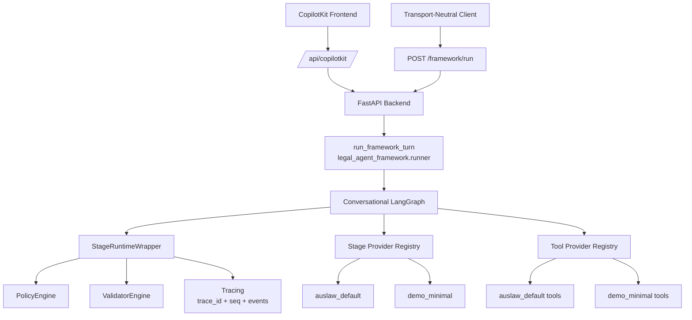
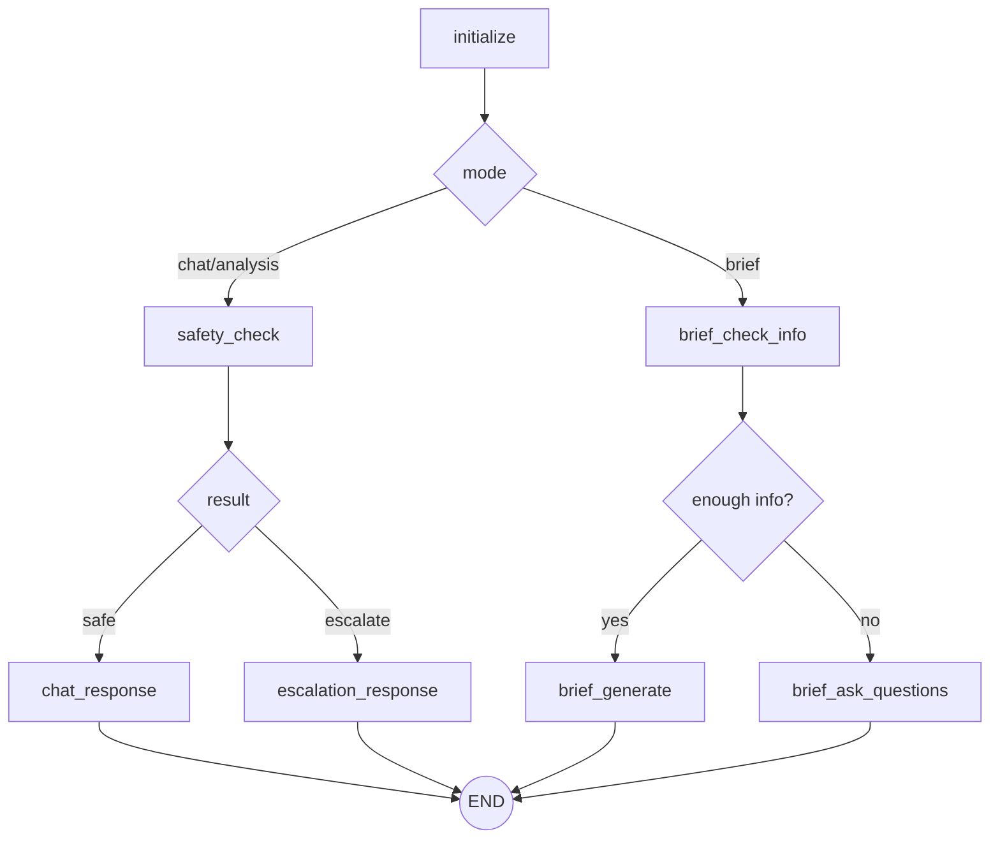

# Project Progress Report (Detailed)

## 1. Report Scope
- Project: `law_agent` evolving into `legal_agent_framework`
- Report date: 2026-02-27
- Scope window: Topic specialization rollout (`general`, `parking_ticket`, `insurance_claim`) through framework extraction and direct package consumption.

## 2. Executive Summary
- The system evolved from an app-bound legal assistant into a framework-first architecture.
- Topic-specific behavior is now explicit and context-driven.
- Core orchestration concerns are implemented in a reusable package:
  - `packages/legal-agent-framework/src/legal_agent_framework`
- Backend now imports `legal_agent_framework` directly.
- Local Docker build path for package dependency is validated.
- Latest reported regression result: 81 passing tests.

## 3. Architecture Evolution (Mermaid)

```mermaid
flowchart LR
  A[Baseline App<br/>Single app flow + transport coupling] --> B[Topic Specialization<br/>general + parking_ticket + insurance_claim]
  B --> C[In-App Frameworkization<br/>contracts + policy + validators + runtime]
  C --> D[Transport Decoupling<br/>request_context + adapters + /framework/run]
  D --> E[Provider Pluggability<br/>stage/tool registries + demo providers]
  E --> F[Structured Tracing<br/>trace_id + seq + replay]
  F --> G[Standalone Package Extraction<br/>packages/legal-agent-framework]
  G --> H[Direct Package Consumption<br/>app imports legal_agent_framework]
```

## 4. Current Runtime Architecture (Mermaid)

## 5. Current Execution Flow (Mermaid)

## 6. Milestone Log

## 6.1 Topic Specialization
### Delivered
- Topic routing supports:
  - `general`
  - `parking_ticket`
  - `insurance_claim`
- Mode-aware prompting supports:
  - `chat` mode
  - `analysis` mode
- Topic playbooks added with domain-specific guidance for:
  - parking/fine challenge strategy
  - insurance claim dispute escalation path (including AFCA workflow)

### Implementation Signals
- Topic/mode context fields in conversation state and normalized request context.
- Topic-specific playbook prompts in chat stage prompt composition.

### Outcome
- Higher precision guidance for common legal scenarios.
- Reduced generic responses for high-frequency issue types.

## 6.2 In-App Frameworkization
### Delivered
- Added framework modules:
  - `contracts`
  - `policy_engine`
  - `validators`
  - `runtime_wrapper`
  - `tracing`
  - `runner`
  - `providers`
- Wrapped graph nodes with runtime wrapper.
- Maintained behavior-safe defaults (observe/warn posture).

### Outcome
- Clear separation of business stages vs orchestration/governance logic.
- Controlled migration path with low regression risk.

## 6.3 Policy and Validator Controls
### Delivered
- Policy rules implemented:
  - `P-001`: jurisdiction required before legal conclusion paths
  - `P-002`: high-risk escalation gating
  - `P-003`: citation expectation guard
- Validator checks implemented:
  - `V-001`: output structure
  - `V-003`: deadline/timing cues
  - `V-005`: guaranteed-outcome language guard
- Enforcement switchboard added:
  - `LAW_FRAMEWORK_ENFORCE_ALL_POLICIES`
  - `LAW_FRAMEWORK_POLICY_ENFORCE_RULES`
  - `LAW_FRAMEWORK_ENFORCE_ALL_VALIDATORS`
  - `LAW_FRAMEWORK_VALIDATOR_ENFORCE_IDS`

### Outcome
- Governance mechanisms can be activated incrementally without hard cutovers.

## 6.4 Transport Decoupling
### Delivered
- Added transport-agnostic context resolver.
- Added CopilotKit-specific adapter module.
- Added transport-neutral endpoint:
  - `POST /framework/run`
- Added local framework runner script independent of CopilotKit transport.

### Outcome
- Framework logic is no longer coupled to a single frontend/runtime transport format.

## 6.5 Provider Pluggability
### Delivered
- Added stage/tool provider registries.
- Added built-in providers:
  - `auslaw_default`
  - `demo_minimal`
- Added env-driven provider selection:
  - `LAW_FRAMEWORK_STAGE_PROVIDER`
  - `LAW_FRAMEWORK_TOOL_PROVIDER`

### Outcome
- Runtime selection of stage/tool stacks without code edits.
- Deterministic demo provider enables robust integration tests.

## 6.6 Structured Tracing
### Delivered
- Standardized trace event model:
  - `trace_id`, `seq`, `stage`, `event_type`, `payload`, `timestamp_utc`
- Runtime now emits structured events for:
  - stage start
  - policy hits
  - validation issues
  - overrides/errors
  - stage complete
- Runner supports trace replay continuity through request/response.

### Outcome
- Better observability and replayability for compliance, debugging, and audit workflows.

## 6.7 Standalone Package Extraction
### Delivered
- Extracted framework into package:
  - `packages/legal-agent-framework`
- Added package metadata:
  - `pyproject.toml`
- Migrated backend/app/tests to direct imports:
  - `legal_agent_framework`
- Removed legacy shim layer:
  - deleted `backend/app/framework/*`
- Runner decoupled from app internals:
  - graph must be provided explicitly to `run_framework_turn(...)`

### Outcome
- Reusable framework boundary is now concrete and enforced by imports.

## 6.8 Build/Test Hardening
### Delivered
- Expanded regression coverage across:
  - runtime
  - tracing
  - runner
  - provider registries
  - request context adapters
  - demo provider switch
  - conversational/brief regressions
- Stabilized test collection with test-safe env defaults.
- Fixed backend Docker build path for editable local framework dependency.

### Outcome
- Migration work is test-backed and deployable in local container workflows.

## 7. Test and Validation Snapshot
- Latest reported pass count: 81 tests.
- Package-related checks include:
  - framework runner contract tests
  - trace ordering/replay tests
  - provider fallback/switch tests
  - extracted package import tests

## 8. Phase Status Against Framework Plan
- Phase 1 (No behavior change): Complete.
- Phase 2 (Control enforcement): Partially complete.
  - Enforcement switches implemented.
  - Default posture remains non-breaking unless enabled.
- Phase 3 (Module replacement/extraction): In progress, major milestone reached.
  - Extracted package exists.
  - Backend now directly consumes package.
  - Publication/versioning pipeline still pending.

## 9. Current Constraints / Open Gaps
- Package is currently consumed via local editable dependency path.
- External distribution workflow (versioning, publish channel, release policy) is not finalized.
- Some policy catalog items remain planned rather than enforced-by-default:
  - `P-004`
  - `P-005`
- Trace retention/redaction policy for production is still TBD.

## 10. Recommended Next Steps
1. Finalize package versioning and release policy (`0.1.x` cadence, changelog, compatibility contract).
2. Add package CI pipeline:
   - lint/type/test matrix
   - wheel/sdist build validation
3. Decide default enforcement posture for `P-004` and `P-005`.
4. Define production trace governance:
   - retention duration
   - redaction requirements
   - access controls
5. Add one consumer example app or SDK-style minimal integration docs for external adopters.

## 11. Reference Artifacts
- Framework package:
  - `packages/legal-agent-framework/src/legal_agent_framework`
- Design document:
  - `framework_v1.md`
- Runtime endpoint:
  - `POST /framework/run`
- Local runner:
  - `backend/scripts/run_framework_local.py`
